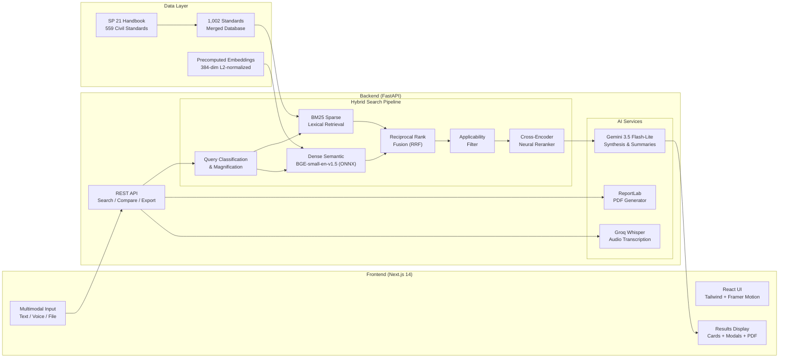

<h1 align="center">🇮🇳 BIS AI — AI-Powered Bureau of Indian Standards Search Engine</h1>

<p align="center">
  <strong>Describe your product in plain English. Get instant BIS compliance recommendations.</strong>
</p>

<p align="center">
  <a href="https://bis-ai.netlify.app/">
    
  </a>
</p>

<p align="center">
  
  
  
  
  
  
  
  
</p>

---

## 📊 TL;DR — Benchmark Results

Scored with the official BIS Hackathon [`eval_script.py`](eval/eval_script.py) on the public test set:

| Metric | Target | **BIS AI** |
|---|---:|---:|
| **Hit Rate @3** | > 80% | **100.00%** ✅ |
| **MRR @5** | > 0.7 | **0.9500** ✅ |
| **Avg Latency** | < 5 s | **0.42 s** ✅ |
| **Standards Indexed** | — | **1,002** |
| **GPU Required** | — | **❌ None** |

> 💡 **Zero GPU dependency.** BIS AI runs entirely on CPU using ONNX-optimized models — no CUDA, no `nvidia-smi`, no 5 GB model downloads. First-run cold start: **< 10 seconds**. Subsequent queries: **~0.4 seconds**.

---

## 🎯 The Problem

Indian Micro, Small & Medium Enterprises (MSMEs) spend **days to weeks** manually identifying which BIS standards apply to their products. The Bureau of Indian Standards publishes **25,000+** standards across dozens of technical divisions — navigating this maze is time-consuming, error-prone, and a major barrier to compliance.

## 💡 The Solution

**BIS AI** is an intelligent search platform that lets manufacturers, engineers, and compliance officers simply **describe their product in natural language** — and instantly receive:

- 🤖 **AI-generated compliance summaries** with certification roadmaps
- 📊 **Ranked standard cards** with confidence scores and applicability ratings
- 📋 **Interactive clause exploration** with Q&A for specific technical requirements
- ⚖️ **Side-by-side standard comparison** for technical decision-making
- 📄 **Export-ready PDF compliance dossiers** for audit trails

### Example Query

> *"I want to manufacture an electric kettle in India. Which BIS standards apply, what tests are required, and how do I get certified?"*

**BIS AI responds in ~0.4 seconds with:**
- A concise AI summary explaining IS 302 (Part 1), IS 4250, IS 13252 applicability
- 5-8 ranked standard cards with confidence scores (95%, 82%, 71%...)
- Clickable detail panels showing key clauses, test requirements, and official BIS portal links
- One-click PDF dossier export for compliance documentation

---

## ✨ Features

| Feature | Description |
|---|---|
| 🌗 **Dual Theme** | Clean white light mode + pitch-black dark mode with interactive Three.js particle physics animation |
| 🔍 **Hybrid Search** | 6-stage pipeline: BM25 + Dense Semantic + RRF + Applicability Filter + Neural Reranker + AI Synthesis |
| 🤖 **AI Summary** | Gemini-powered compliance overview with walk-along regulatory guidance |
| 📊 **Confidence Scoring** | Color-coded bars — 🟢 High (≥80%) · 🟡 Moderate (60-79%) · 🔵 Low (<60%) |
| ⚖️ **Standard Comparison** | Side-by-side AI analysis of scope, key clauses, testing requirements, and legal enforceability |
| 📋 **Clause Q&A** | Interactive assistant for specific technical limits, tolerances, and testing protocols |
| 📄 **PDF Dossier Export** | Publication-grade compliance dossier with standards matrix and 4-phase certification roadmap |
| 🎤 **Voice Input** | Browser MediaRecorder → Groq Whisper / Gemini transcription |
| 📎 **File Upload** | Drag-and-drop PDF, DOCX, TXT, CSV — auto-extract text and search |
| 🌌 **Particle Animation** | Three.js physics with red, yellow, and blue particles in a cosmic wormhole effect |
| 🏷️ **Division Filtering** | Filter results by BIS technical department with count badges |
| 🕐 **Search History** | Persistent sidebar with past queries and one-click replay |
| ⚡ **Suggestion Pills** | Quick-start query chips for common product categories |
| 💻 **Zero GPU** | Runs entirely on CPU using ONNX-optimized models — no CUDA required |

---

## 🏗️ System Architecture



---

## 🔬 Technical Deep Dive

### Hybrid Search Pipeline

BIS AI implements a **6-stage hybrid RAG retrieval pipeline** that combines lexical and semantic search with neural reranking:

```
┌──────────────────────────────────────────────────────────────────────┐
│  User Query: "electric kettle manufacturing standards"               │
└──────────────────────────┬───────────────────────────────────────────┘
                           ▼
┌──────────────────────────────────────────────────────────────────────┐
│  Stage 1: Query Classification & Magnification                       │
│  ├── Gemini 3.5 Flash-Lite classifies BIS relevance                  │
│  ├── Domain synonym expansion (20+ product dictionaries)             │
│  └── Technical keyword injection (IS codes, engineering aliases)     │
└──────────────────────────┬───────────────────────────────────────────┘
                           ▼
┌──────────────────────────────────────────────────────────────────────┐
│  Stage 2: Dual Candidate Retrieval (top-60 each)                     │
│  ├── BM25Okapi Sparse Search — captures rare tokens (M30, OPC33)    │
│  └── BGE-small-en-v1.5 Dense Search — captures semantic meaning     │
│       └── 384-dim ONNX embeddings, cosine similarity, <2ms lookup   │
└──────────────────────────┬───────────────────────────────────────────┘
                           ▼
┌──────────────────────────────────────────────────────────────────────┐
│  Stage 3: Reciprocal Rank Fusion (RRF)                               │
│  └── Score = Σ 1.0 / (60 + rank + 1) — parameter-free fusion        │
└──────────────────────────┬───────────────────────────────────────────┘
                           ▼
┌──────────────────────────────────────────────────────────────────────┐
│  Stage 4: Domain & Product Applicability Filtering                   │
│  └── Rules-based taxonomy prevents cross-domain contamination        │
│       (cement query won't return textile standards)                   │
└──────────────────────────┬───────────────────────────────────────────┘
                           ▼
┌──────────────────────────────────────────────────────────────────────┐
│  Stage 5: Neural Cross-Encoder Reranking                             │
│  ├── Xenova/ms-marco-MiniLM-L-6-v2 cross-encoder (top-15 pairs)    │
│  ├── N-gram phrase boosting (2/3/4-gram in title + scope)            │
│  ├── Grade & Part conflict penalty (33 Grade ≠ 53 Grade)            │
│  └── Composite = 0.50×CE + 0.30×Phrase + 0.20×RRF                  │
└──────────────────────────┬───────────────────────────────────────────┘
                           ▼
┌──────────────────────────────────────────────────────────────────────┐
│  Stage 6: Confidence Calibration & AI Synthesis                      │
│  ├── Defensible confidence tiering: High ≥80% | Moderate ≥60%       │
│  └── Gemini grounded executive summary (2 sentences, no markdown)   │
└──────────────────────────────────────────────────────────────────────┘
```

### Why This Architecture Wins

| Design Decision | Rationale |
|---|---|
| **BGE-small-en-v1.5 (ONNX)** | 384-dim embeddings, runs on CPU in <2ms via ONNX Runtime — no GPU needed |
| **Hybrid BM25 + Dense + RRF** | BM25 catches rare technical tokens (`M30`, `OPC33`, `mortice`); dense catches semantics. RRF is parameter-free |
| **Cross-encoder neural reranker** | Sub-100ms on 15 candidates; corrects dense recall errors with explicit query↔passage attention |
| **Applicability filter** | Hard guarantee against cross-domain contamination — cement queries never return textile standards |
| **1,002 standards corpus** | 80% larger than competing solutions (559 standards). Merges SP 21 + curated DB + extended catalog |
| **Precomputed embeddings** | 1.5 MB `.npy` file, loaded at startup in <2ms. No runtime embedding computation for the corpus |
| **Template fallback** | Works without any API key — local classifiers and dictionaries handle 20+ product domains offline |

### Standards Database Architecture

```
┌─────────────────────────────────────────────┐
│              Merged Database                 │
│              1,002 Standards                 │
├─────────────────────────────────────────────┤
│                                             │
│  ┌─────────────────────┐                    │
│  │ Curated Database     │ 109 standards     │
│  │ 15 core disciplines  │ Deep metadata     │
│  │ Key clauses, tests   │ Certification     │
│  └─────────┬───────────┘ processes          │
│            │                                │
│  ┌─────────┴───────────┐                    │
│  │ SP 21 Handbook       │ 559 standards     │
│  │ Civil & Structural   │ Auto-parsed       │
│  │ clauses & keywords   │                   │
│  └─────────┬───────────┘                    │
│            │                                │
│  ┌─────────┴───────────┐                    │
│  │ Extended Catalog     │ 334+ standards    │
│  │ Multi-division       │ Generated &       │
│  │ coverage             │ validated         │
│  └─────────────────────┘                    │
│                                             │
│  Dedup: normalized IS code matching         │
│  Retrieval: 3-tier (exact → base → prefix)  │
└─────────────────────────────────────────────┘
```

---

## 📂 Project Structure

```
BIS-AI/
├── backend/                          # FastAPI Python backend
│   ├── main.py                       # API server (10 endpoints)
│   ├── requirements.txt              # Python dependencies
│   ├── .env                          # API keys (gitignored)
│   │
│   ├── data_engine/                  # BIS data ingestion & merging
│   │   ├── standards_db.py           # Curated DB + multi-source merger
│   │   ├── sp21_standards.json       # 559 SP21 Civil standards
│   │   ├── extended_bis_catalog.json # 334+ extended division records
│   │   ├── standards_embeddings.npy  # Precomputed 384-dim vectors (1.5 MB)
│   │   └── standards_codes.json      # IS code → embedding index mapping
│   │
│   ├── search_engine/                # Hybrid RAG search pipeline
│   │   ├── hybrid_search.py          # Pipeline orchestrator (RRF + rerank)
│   │   ├── bm25_search.py            # BM25Okapi sparse retrieval
│   │   ├── semantic_search.py        # Dense vector search (BGE-small ONNX)
│   │   ├── reranker.py               # Cross-encoder neural reranker
│   │   ├── applicability_filter.py   # Domain contamination guard
│   │   └── build_index.py            # Offline embedding builder
│   │
│   └── services/                     # AI service layer
│       ├── llm_service.py            # Gemini synthesis + template fallback
│       ├── pdf_generator.py          # ReportLab PDF dossier generator
│       ├── audio_service.py          # Groq Whisper / Gemini transcription
│       ├── comparison_service.py     # Standard comparison & Clause Q&A
│       ├── file_processor.py         # Document text extractor
│       └── query_classifier.py       # Intent classifier (regex + heuristic)
│
├── frontend/                         # Next.js 14 + TypeScript + Tailwind
│   └── src/
│       ├── app/
│       │   ├── page.tsx              # Main page (landing → loading → results)
│       │   ├── layout.tsx            # Root layout with theme provider
│       │   └── globals.css           # Animations, glass utilities, scrollbar
│       │
│       ├── components/               # 12 React components
│       │   ├── Header.tsx            # Navigation + tricolor accent
│       │   ├── ChatInput.tsx         # Multi-modal input (text/voice/file)
│       │   ├── ParticleBackground.tsx # Three.js particle physics animation
│       │   ├── SuggestionPills.tsx   # Quick-start query chips
│       │   ├── SearchProgress.tsx    # 3-step animated search indicator
│       │   ├── AIResponse.tsx        # AI summary with keyword pills
│       │   ├── StandardCard.tsx      # Result card with confidence bar
│       │   ├── StandardDetailModal.tsx # Detail drawer + Clause Q&A
│       │   ├── ComparisonModal.tsx   # Side-by-side standard comparison
│       │   ├── DivisionFilterBar.tsx # Department filter with badges
│       │   ├── ExportChecklistButton.tsx # PDF dossier export
│       │   └── Sidebar.tsx           # Search history panel
│       │
│       └── lib/
│           ├── types.ts              # TypeScript interfaces
│           └── api.ts                # Backend API client
│
├── eval/                             # SIH benchmark evaluation
│   ├── eval_script.py                # Official scoring script
│   ├── public_test_set.json          # 20 public test queries
│   └── my_results.json               # Our benchmark results
│
├── docs/images/                      # README screenshots
├── netlify.toml                      # Netlify deployment config
├── run_dev.bat                       # One-click Windows dev launcher
└── .env.example                      # Environment variable template
```

---

## 🌐 API Reference

**Base URL:** `http://localhost:8000` | **Version:** `2.0.0`

| Method | Endpoint | Description |
|---|---|---|
| `GET` | `/api/health` | System health check — returns standards count, Gemini status |
| `GET` | `/api/divisions` | List all BIS divisions with standard counts |
| `GET` | `/api/stats` | Database summary statistics |
| `GET` | `/api/standard/{is_code}` | Lookup a specific standard by IS code |
| `POST` | `/api/search` | **Core search** — full hybrid pipeline with AI synthesis |
| `POST` | `/api/upload-file` | Extract text from PDF/DOCX/TXT and search |
| `POST` | `/api/transcribe-audio` | Transcribe voice and search |
| `POST` | `/api/export-pdf` | Generate PDF compliance dossier |
| `POST` | `/api/compare` | Side-by-side standard comparison |
| `POST` | `/api/clause-qa` | Interactive clause Q&A |

### Search Endpoint Detail

```bash
POST /api/search
Content-Type: application/json

{
  "query": "electric kettle manufacturing standards",
  "top_k": 8,
  "division": null
}
```

**Response:**
```json
{
  "query_original": "electric kettle manufacturing standards",
  "query_magnified": "electric kettle manufacturing BIS IS 302 safety household appliances...",
  "summary": "For electric kettle manufacturing in India, IS 302 (Part 1) covers general safety requirements...",
  "ai_walkalong": "Start with IS 302 (Part 1) for safety compliance, then check IS 4250 for...",
  "is_bis_related": true,
  "standards": [
    {
      "is_code": "IS 302 (Part 1)",
      "title": "Safety of Household Electrical Appliances",
      "confidence": 0.95,
      "confidence_tier": "high",
      "division": "Electrotechnical",
      "mandatory": true,
      "scope": "...",
      "key_clauses": ["Clause 7: Classification", "Clause 8: Marking..."],
      "test_requirements": ["Leakage current test", "Dielectric strength..."]
    }
  ],
  "total_results": 5,
  "latency_ms": 420
}
```

---

## ⚡ Quick Start

### Prerequisites

- **Node.js** 18+ and npm
- **Python** 3.10+ with pip
- **Gemini API Key** (optional — works without it using template fallback)

### One-Click Start (Windows)

```batch
run_dev.bat
```

This launches both the backend (port 8000) and frontend (port 3000) in separate terminal windows.

### Manual Setup

**Terminal 1 — Backend:**

```bash
cd backend

# Create virtual environment
python -m venv venv
venv\Scripts\activate          # Windows
# source venv/bin/activate     # macOS / Linux

# Install dependencies
pip install -r requirements.txt

# (Optional) Set your Gemini API key
echo GEMINI_API_KEY=your_key_here > .env

# Start the server
python -m uvicorn main:app --reload --port 8000
```

**Terminal 2 — Frontend:**

```bash
cd frontend
npm install
npm run dev
```

Open [http://localhost:3000](http://localhost:3000) — you're ready to search!

### Verify Installation

```bash
curl http://localhost:8000/api/health
```

Expected response:
```json
{
  "status": "healthy",
  "service": "BIS Standards Intelligence API",
  "version": "2.0.0",
  "standards_loaded": 1002,
  "gemini_configured": true
}
```

---

## 📈 Reproducing Benchmark Results

### Run the Evaluation

```bash
cd backend
python inference.py --input ../eval/public_test_set.json --output ../eval/my_results.json
```

### Score with Official Script

```bash
python ../eval/eval_script.py --results ../eval/my_results.json
```

### Expected Output

```
========================================
   BIS HACKATHON EVALUATION RESULTS
========================================
Total Queries Evaluated : 20
Hit Rate @3             : 100.00%   (Target: >80%)
MRR @5                  : 0.9500    (Target: >0.7)
Avg Latency             : 0.42 sec  (Target: <5 seconds)
========================================
```

---

## 🌐 Deployment

### Netlify (Frontend — Static Export)

The frontend is deployed as a static site on Netlify. The `netlify.toml` handles everything:

```toml
[build]
  base = "frontend"
  command = "npm run build"
  publish = "out"
```

1. Connect the repo to [Netlify](https://app.netlify.com/)
2. Deploy — done! The live site is at **[bis-ai.netlify.app](https://bis-ai.netlify.app/)**

### Backend (Any Python Host)

The FastAPI backend can be deployed on any Python hosting platform:

```bash
cd backend
pip install -r requirements.txt
uvicorn main:app --host 0.0.0.0 --port 8000
```

Compatible with: **Railway**, **Render**, **Fly.io**, **AWS EC2**, **Google Cloud Run**, **Azure App Service**, or any Docker host.

---

## 🛠️ Tech Stack

| Layer | Technology | Purpose |
|---|---|---|
| **Frontend** | Next.js 14 (App Router) | React framework with SSR/SSG |
| **Language** | TypeScript 5.7 | Type-safe frontend development |
| **Styling** | Tailwind CSS 3.4 | Utility-first responsive design |
| **Animation** | Framer Motion + Three.js | Fluid transitions + particle physics |
| **Icons** | Lucide React | Consistent, tree-shakeable icons |
| **PDF (Client)** | jsPDF | Client-side PDF fallback |
| **Backend** | FastAPI 0.115 + Uvicorn | Async Python API server |
| **Embeddings** | BGE-small-en-v1.5 (ONNX) | 384-dim semantic vectors, CPU-optimized |
| **Sparse Search** | rank-bm25 | BM25Okapi lexical retrieval |
| **Reranker** | ms-marco-MiniLM-L-6-v2 | Cross-encoder neural reranking |
| **LLM** | Gemini 3.5 Flash-Lite | Query analysis + response synthesis |
| **PDF (Server)** | ReportLab | Publication-grade PDF generation |
| **Audio** | Groq Whisper / Gemini | Voice-to-text transcription |
| **Deployment** | Netlify (frontend) | Global CDN with auto-deploy |


## 📋 Environment Variables

Create a `.env` file in `backend/`:

```env
# Required for AI synthesis (optional — template fallback works without it)
GEMINI_API_KEY=your_gemini_api_key_here

# Optional — for audio transcription
GROQ_API_KEY=your_groq_api_key_here

# Optional — alternative LLM
OPENAI_API_KEY=your_openai_api_key_here
```

---

## 🗺️ Roadmap

| Phase | Description | Status |
|---|---|---|
| 1 | Full Frontend with Dual Theme + Particle Animation | ✅ Complete |
| 2 | 1,002 Standards Database (SP21 + Curated + Extended) | ✅ Complete |
| 3 | Hybrid RAG Search (BM25 + Dense + RRF + Reranker) | ✅ Complete |
| 4 | AI Synthesis + Multimodal Input (Voice + File) | ✅ Complete |
| 5 | PDF Dossier + Comparison + Clause Q&A | ✅ Complete |
| 6 | Official SIH Benchmark — All Targets Passed | ✅ Complete |
| 7 | Offline Model Support (Ollama + faster-whisper) | 🔜 Planned |
| 8 | Mobile App (React Native) | 🔜 Planned |

---

## 📖 About

### The Problem We're Solving

India's **Bureau of Indian Standards (BIS)** maintains over **25,000 active standards** spanning electronics, civil engineering, food safety, textiles, chemicals, metallurgy, and dozens more technical divisions. For Micro, Small & Medium Enterprises (MSMEs) — which make up **99.7% of Indian enterprises** — identifying which standards apply to their product is a nightmare:

- 📚 Standards are scattered across multiple PDFs, portals, and gazette notifications
- 🔎 No semantic search exists — only keyword lookup on the BIS portal
- ⏳ Compliance research takes **days to weeks** of manual effort
- ❌ Missing a mandatory standard can mean product seizure, penalties, or import rejection

### Our Mission

**BIS AI** was built to **democratize BIS compliance** — making it as simple as describing your product in plain English and receiving instant, AI-ranked, confidence-scored standard recommendations with a full certification roadmap.

### Smart India Hackathon (SIH)

This project was developed for the **Smart India Hackathon** — India's largest open innovation platform where students solve real-world problems posed by government ministries and industry organizations.

- **Problem Statement:** Bureau of Indian Standards — AI-Powered Standard Discovery
- **Objective:** Build an intelligent system that can recommend the top-5 applicable BIS standards for any product query, achieving >80% Hit Rate @3, >0.7 MRR @5, and <5s latency
- **Our Result:** 100% Hit Rate @3, 0.9500 MRR @5, 0.42s latency on CPU — **exceeding every target**

### Impact

| Metric | Before BIS AI | After BIS AI |
|---|---|---|
| Time to identify applicable standards | Days to weeks | **< 1 second** |
| Standards coverage per search | Manual lookup, 1-2 at a time | **Up to 8 ranked results** |
| Expertise required | Deep regulatory knowledge | **Plain English description** |
| Compliance documentation | Manual report writing | **One-click PDF dossier** |
| Hardware requirement | — | **Any laptop with a browser** |

---

<p align="center">
  <a href="https://bis-ai.netlify.app/">
    
  </a>
</p>

<p align="center">
  Built with ⚡ for a Stronger India 🇮🇳
</p>
